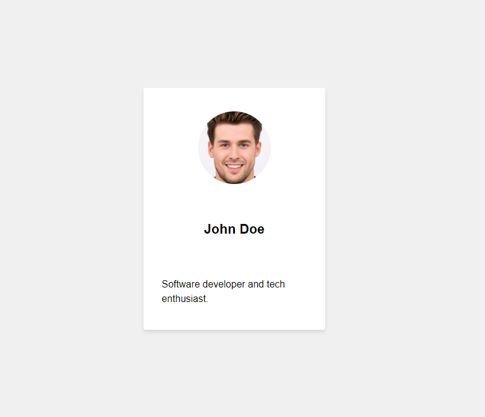

# Profile Card Component
This project demonstrates the implementation of a Profile Card component in a React TypeScript application. The component displays a user's name, profile picture, and bio.

## Versions
There are two versions of the app, each with a different implementation of the Profile Card component.

### Master Branch - Regular React App
In the `master` branch, the Profile Card component is a regular React component that includes the Profile Name, Profile Picture, and Profile Bio components directly inside it. The parent `App` component imports the `ProfileCard` component and uses it without passing any children to it.

### With-Compound Branch - Compound Components
In the `with-compound` branch, the Profile Card component follows the compound components design pattern. This pattern allows the component to accept children components, providing greater flexibility in terms of composition. In this version, the `App` component imports the `Profile` component, which in turn imports the `ProfileCard`, `ProfileName`, `ProfilePicture`, and `ProfileBio` components. These components are then used as children of the `ProfileCard` component.

To switch between the two versions, you can check out the corresponding branch in your Git repository.

## Screenshots

## Live Demo
Experience the Profile Card Component in action by visiting the live demo:

[Profile Card Component Live Demo](https://obrm-profile-card.netlify.app)

## Usage
To run the app locally, follow these steps:

1. Clone the repository and navigate to the project folder.
2. Run `npm install` to install the required dependencies.
3. Run `npm run dev` to start the development server.
4. Open your browser and visit http://localhost:5173 to view the app.

#### Technologies Used

* [React](https://reactjs.org/)
* [TypeScript](https://www.typescriptlang.org/)
* [SCSS](https://sass-lang.com/)
* [Vite](https://vitejs.dev/)

#### License

[MIT](https://choosealicense.com/licenses/mit/)

## Contact Information
For any questions, concerns, or support, feel free to reach me out via email: [obrm770@gmail.com](mailto:obrm770@gmail.com).